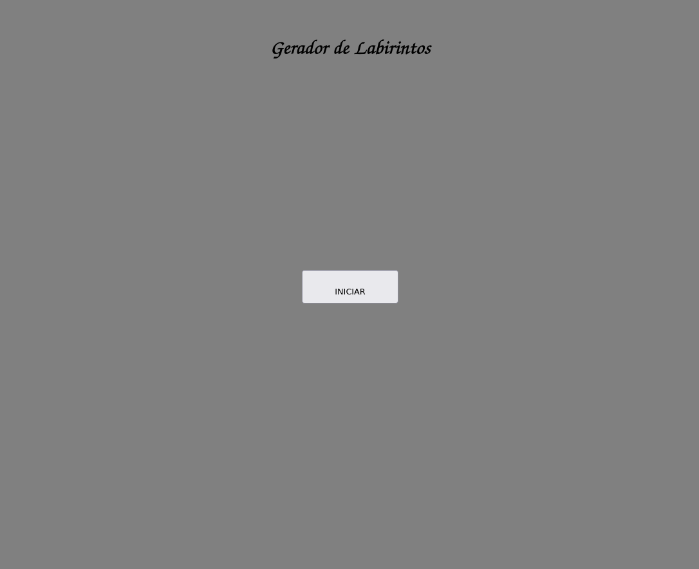
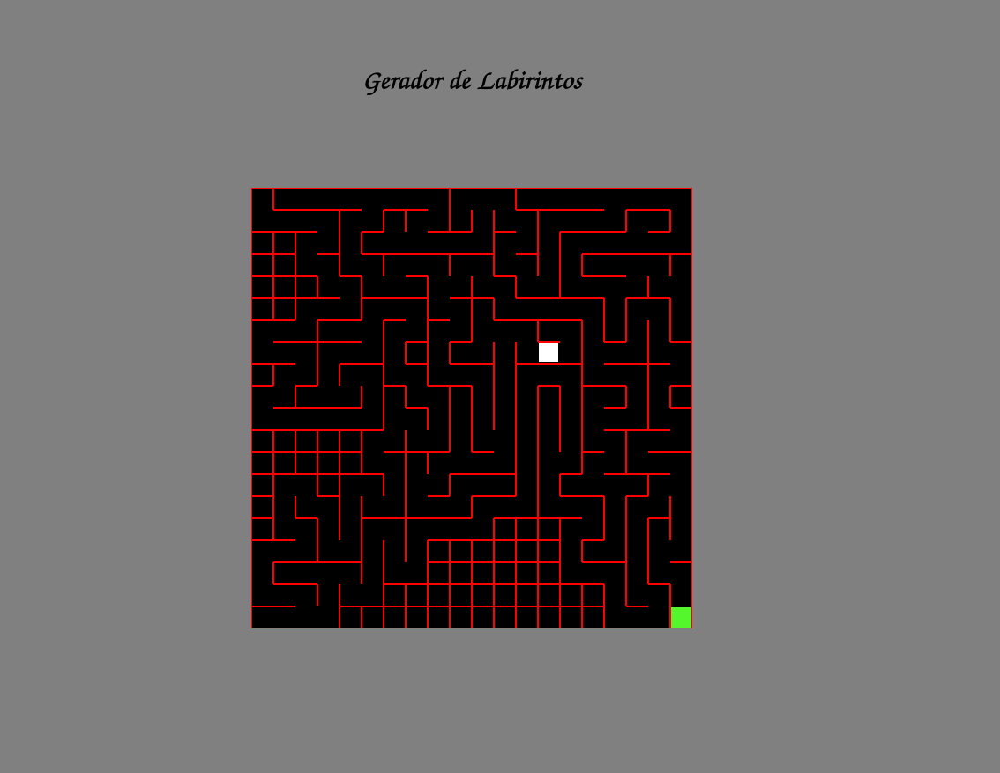
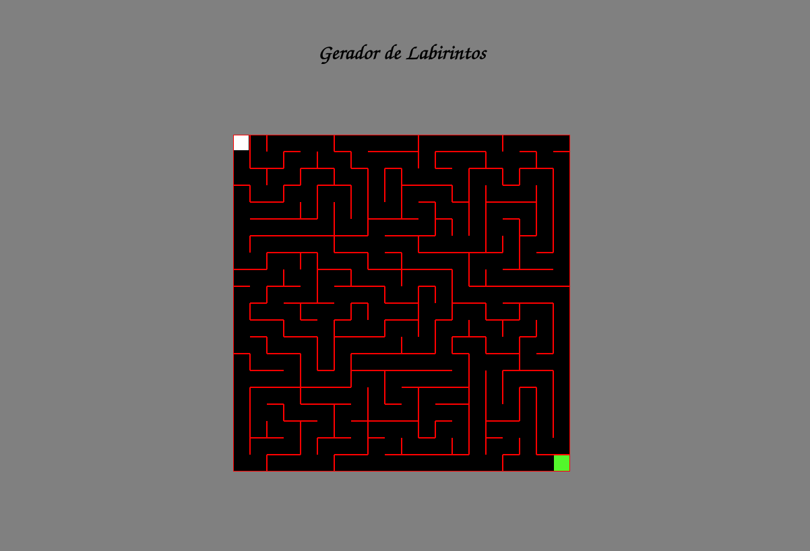

# Grafos1_Maze

**Número da Lista**: 1 
**Conteúdo da Disciplina**: Grafos 1 

## Alunos
|Matrícula | Aluno |
| -- | -- |
| 15/0129807  |  Ĩcaro Pereira de Oliveira |
| 14/0058371  |  Augusto Moreno Vilarins |

## Sobre 
Descreva os objetivos do seu projeto e como ele funciona.
Esse projeto implementa um labirinto utilizando DFS para percorrê-lo. 
O usuário também consegue jogar após o labirinto ser percorrido.

## Screenshots

## Instalação 
**Linguagem**: Javascript + HTML + CSS  

Clone o repositório e basta abrir o arquivo HTML em um navegador.

## Uso 

Abra o arquivo, aguarde o labirinto ser percorrido e jogue se desejar. Para gerar outro labirinto
basta atualizar a página.

## Outros 

Vídeo: https://youtu.be/yYdyBvbUYRc

